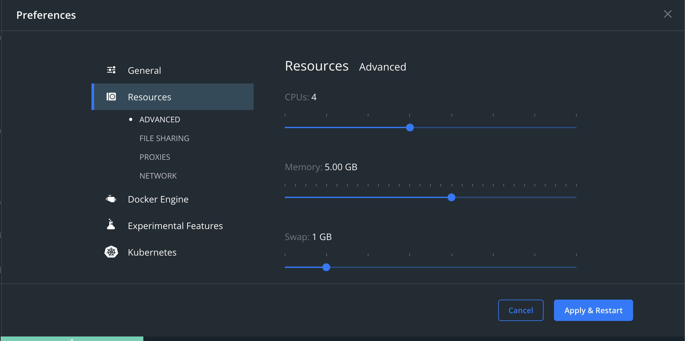

# AIRFLOW INSTALLATION

Thid airflow installation guide is based on [airflow documentation](https://airflow.apache.org/docs/apache-airflow/stable/howto/docker-compose/index.html)

1. Git clone this repo

This docker requires 4GB memory usage, check your docker memory
allocation by running this command on terminal

```
docker info
```

This command will show information, includes this info

```
CPUs: 4
Total Memory: 3.841GiB
Name: docker-desktop
```

If you need to reallocate memory, change the RAM
allocation in docker desktop settings.



If you run it in Apple Silicon Device,
then [install rosetta](https://docs.docker.com/desktop/install/mac-install/)
and ensure to execute

```
export DOCKER_DEFAULT_PLATFORM=linux/amd64
```

2. Initialize the database by

```
docker compose up airflow-init
```

After initialization is complete, you should see a message like this:

```
airflow-init_1       | Upgrades done
airflow-init_1       | Admin user airflow created
airflow-init_1       | 2.5.2
start_airflow-init_1 exited with code 0
```

The account created has the login `airflow` and the password `airflow`.


3. Running Airflow by

```
docker compose up -d
```

4. In a second terminal you can check the condition of the containers and make sure that no containers are in an unhealthy condition by running

```
docker ps
```

This command will show

```
$ docker ps
CONTAINER ID   IMAGE                  COMMAND                  CREATED          STATUS                    PORTS                              NAMES
247ebe6cf87a   apache/airflow:2.5.2   "/usr/bin/dumb-init …"   3 minutes ago    Up 3 minutes (healthy)    8080/tcp                           compose_airflow-worker_1
ed9b09fc84b1   apache/airflow:2.5.2   "/usr/bin/dumb-init …"   3 minutes ago    Up 3 minutes (healthy)    8080/tcp                           compose_airflow-scheduler_1
7cb1fb603a98   apache/airflow:2.5.2   "/usr/bin/dumb-init …"   3 minutes ago    Up 3 minutes (healthy)    0.0.0.0:8080->8080/tcp             compose_airflow-webserver_1
74f3bbe506eb   postgres:13            "docker-entrypoint.s…"   18 minutes ago   Up 17 minutes (healthy)   5432/tcp                           compose_postgres_1
0bd6576d23cb   redis:latest           "docker-entrypoint.s…"   10 hours ago     Up 17 minutes (healthy)   0.0.0.0:6379->6379/tcp             compose_redis_1
```